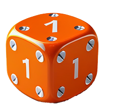

# Pig game 🐷
this game developed in JS need two player 
---
 in start player one can roll a dice and collect point but if player get number **one** side will be switched and all of current will be lost 

 
 
## players can save their point by click on holds after that side will be switched again 

**+who ever reach to 100 point is the winner**